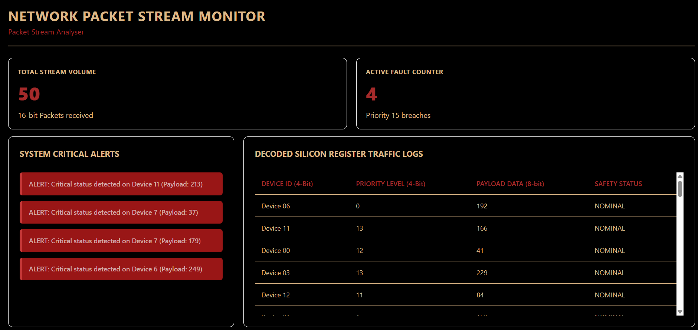

[View Demo](https://neelanshshukla.github.io/16-Bit-Register-Telemetry-Stream-Monitor/)
Preview:

built an end-to-end telemetry dashboard. A Python script simulates 16-bit hardware register streams. A compiled C binary opens that raw traffic and runs bare-metal bitwise shifts to decode the packed data parameters. Finally, a frontend JavaScript timing loop dynamically reads the output, updates system metric cards, and surfaces critical hardware alerts onto dashboard every 2 seconds.
